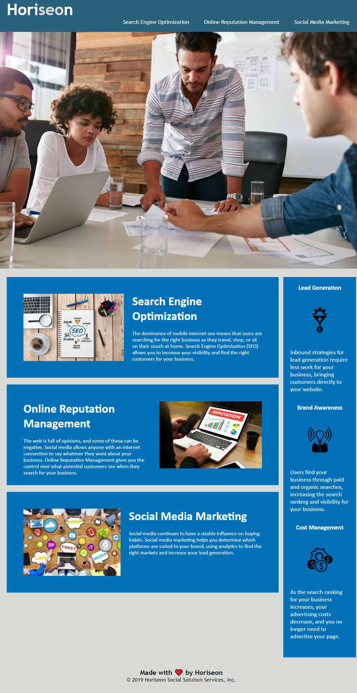

# Horiseon

## Description

We were given this code and asked to clean up the HTML, as this code was not symantic and was rather clunky, so what I've done is cleaned up sections I believe could be altered or simplified and commented on the changes made in the code.

My motivation was driven as I want to be able to make the cleanest form of code I can, so that way anyone can read  without any real confusion.
I did this so I could hone my skills learned from week one of Coding HTML/CSS and use them practically.
Whilst doing this, I uncovered I quite often find myself looking beyond the scope, and make at times make a mess, doing this and looking over it multiple times, made me realise that I was doing this, which assisted me in bringing it back and focusing exclusively on the content we've learned.
This Challenge aided me in classes, and really making sure I adjust all elements within the css class. It was nice to do on an established webpage that I can compare designs if I ever stray too far.

## Installation

N/A

## Usage

https://daleduiv.github.io/Horiseon/
  

  

## Credits

https://adelaide.bootcampcontent.com/the-university-of-adelaide/UADEL-VIRT-FSF-PT-08-2022-U-LOLC/-/tree/main/01-HTML-Git-CSS

Alexis San Javier; Tutor

## License

MIT License

## Badges

N/A

## Features

N/A

## How to Contribute

N/A
## Tests

N/A